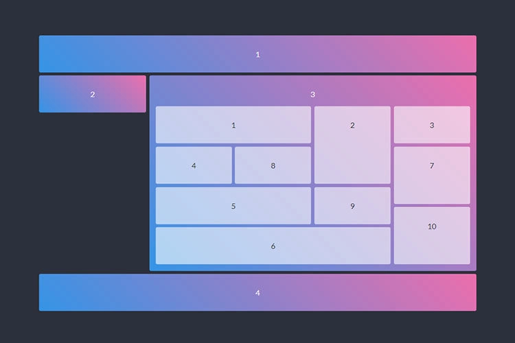
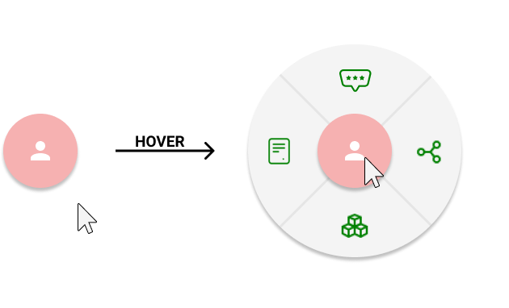

Phần 1 - Trả lời các câu hỏi sau

## HTML

1. HTML là viết tắt của ...?
Hypertext Mardown Language

2. Có phải tất cả các thẻ HTML đều có thẻ đóng?
No

3. Thẻ Marquee là gì, tác dụng ra sao?
Marque Tag is a container tag use to store elements/components that are scrollable.

4. Sự khác biệt HTML4 và HTML5
HTML5 have improved and add more element as such as canvas, drawing, etc.

5. Khai báo <!DOCTYPE> trong HTML có tác dụng gì?
HTML document must start with <!DOCTYPE> (which genuinely is not a tag). It tell the browser whta type of information the browser can expect.

6. Tại sao nên đặt `<link>` trong thẻ `<head></head>` và đặt `<script>` trước thẻ `</body>`. Ngoại lệ khi nào?
The tag <link> should be inside the head because you want the link to loaded first before everything, before it access to the body, before rendering.
The tag <script> should be at the very end of the body because you want your script to star running after every component is already in place, if you put it inside <head></head> your JS run first before all the elements, components in your <body></body> is not loaded then.


7. HTML Sematic là gì?
HTML Sematic is all the tags, elements that do something/ or with a meaning, not cotainer like <div>, <span>, etc.

8. Kể tên các thẻ Semantic bạn biết
<main>
<footer>
<form>
<nav>
<h1>, <h2>, <h3>, <h4>, <h5>, <h6>
<table>

9. Trình bày cách làm việc (workflow) của bạn khi bạn tạo một trang web?

1. Analysis what's the need of the website, how's that website going to look, function, etc
2. Research for ideas, information, element, etc.
3. Sketch a low fidelity prototype (on paper mostly), this prototype is for me to think how this web is going to structure
4. Sketch a medium fidelity prototype (draw on Canvas and have features as such as when click a button, is going to head where, link between element). This is to visualise how the functional aspect of the web is going to workl
5. Gather the data, assets
6. Program the code for the website
7. Suggesting doing a SCUM procedure where your your tutor is both the stakeholder and a teamleader for feedback and improvement
8. When the web is done, clean the code for easy maintainance in the future.
## CSS

10. Phân biệt position absolute và relative

position: realive will move when you applying css on the component

11. CSS là viết tắt của ...?
Causcading Style Sheet

12. Lợi / hại của việc sử dụng External Style Sheets?
Pros:
- Keep your CSS away from your HTML, easier to look at and maintenance, you can have each style sheet for each component making it easier to maintain
- Better performace

Cons:
- May be a bit more complicated to set up
- When u code, it is kind of frustated to find the css file in your files
- Each CSS is a HTML request so it going to be slower.

13. Có mấy cách để sử dụng CSS trên trang web?
There are 3 ways:
External CSS, Internal CSS and Inline CSS

14. Phân biệt display: block và display: inline
Display: block: the component is going to take the whole line of that page
Display: inline: only take the require width, you can stake many different display: inline elements onto the same line 

15. Khác nhau giữa Class selector và Id selector?
Class selector:
-Start with .
-Can be in as much elements as possible


ID selector:
-Start with #
-Should only be use once, because ID should be unique
-Have a higher specifility over class, meaning if an element have #red and .blue for the background, the color would be blue


16. Hãy kể các breakpoints thông dụng. Viết 1 đoạn code thể hiện “Mobile first” và “PC first”
Common BreakPoint:
-576px for small device like phone
-768px for medium device tablet
-1024,1080,... for desktop

Mobile first
css:
.container {
    padding: 10px;
    background-color: red;
}
@media only screen and (min-width: 1080px) {
    .container {
        padding: 40px;
        background-color: lightcoral;
    }
}

Desktop first
css:

    .container {
    padding: 10px;
    background-color: blue;
}
@media only screen and (min-width: 576px) {
    .container {
        padding: 20px;
        background-color: lightblue;
    }
}

17. Mặc định thuộc tính display trong thẻ div, span, ul là gì
div is a block
span is an inline
ul is a block

18. z-index dùng để làm gì?
z-index is like layer, it to know if two items, components overlapping, which elements if going on top, which is going on the botto,


19. Cách nào để khôi phục thuộc tính mặc định của một đối tượng?
use initial

## JS

20. JavaScript các kiểu biến dạng nào?
    - d. Tất cả các loại trên

21. Cách khai báo mảng nào trong JavaScript là đúng?

    - a. var colors = ["red", "green", "blue"]
    
22. Ngôn ngữ JS có phân biệt chữ hoa và chữ thường:

    - a. Có
    

23. JavaScript là ngôn ngữ xử lý ở:

    - c. Server/client
    

24. Javascript là ngôn ngữ thông dịch hay biên dịch

    - a. Thông dịch
   

25. Trong Javascript hàm parseInt() dùng để làm gì?

    - b. Chuyển một chuỗi thành số nguyên
=

26. `{a:1}=={a:1}`

    - b. False

27.

```js
var obj = {
  _name: "CaMapCanCap",
  getMySecretName: function () {
    return this._name;
  },
};
var stoleCaMapName = obj.getMySecretName;
console.log(stoleCaMapName());
console.log(obj.getMySecretName());
```

- b. undefined CaMapCanCap

28.

```js
for (var i = 0; i < 3; i++) {
  setTimeout(() => console.log(i), 1);
}

for (let i = 0; i < 3; i++) {
  setTimeout(() => console.log(i), 1);
}
```

- b. 0 1 2 and 3 3 3

### B. PHẦN 2: TỰ LUẬN

29. Dựng layout bên dưới (màu sắc có thể thay đổi)
    


30. Tạo button với hiệu ứng bên dưới (Icon, màu sắc tuỳ ý)
    


31. Nhập vào mảng A, trả về mảng B gồm các phần tử chẵn của mảng A.
    


32. Tạo một website với mỗi section có chiều cao là 100vh. Tạo hiệu ứng scroll xuống từng section, cứ mỗi lần scroll sẽ đi xuống hoặc đi lên 1 section
q32 folder 
